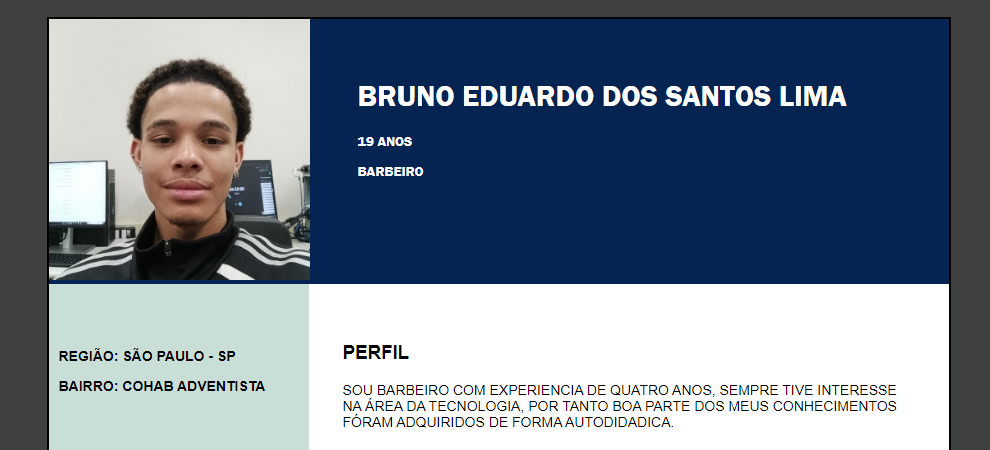

# Atividade Apresente-se

Criar uma apresentação pessoal em forma de curriculo com html e css!

## Previa Curriculo

## Linguagens usadas

Para a realização do desafio e necessario conhecimentos básico em HTML e CSS.

### Construído com

- HTML5 
- CSS3

## Meu processo

Este código HTML com CSS traz um currículo meu com informações onde traz minhas experiencias profissionais, região onde moro, curiosidades etc.

## Author

- GitHub - [@s7lima](https://github.com/s7lima)

## Links

-  [Repositório](https://github.com/s7lima/Perfil-Bruno)
-  [Site](https://perfil-bruno.vercel.app/)

